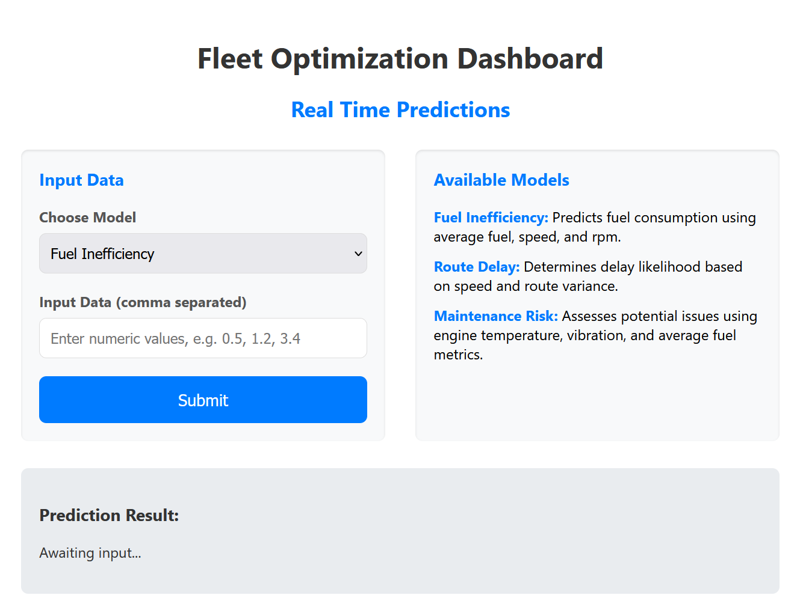

# Smart Fleet Optimization with Sensor Fusion


Smart Fleet Optimization with Sensor Fusion is a machine learning system designed to improve how vehicle fleets operate. By combining data from multiple sensors including CAN bus logs, GPS routes, camera video, and engine sound recordings, the system learns to identify patterns that can lead to fuel waste, delivery delays, or maintenance issues.

The aim of this project is to provide a complete end to end solution. It handles data collection and processing, builds predictive models, and offers a lightweight interface for real time usage. 
(In Progress > Adding additional features soon)

## Key Features

- Collects data from vehicle sensors, including speed, fuel rate, location, and audio or visual input
- Combines all data streams into a unified format using timestamp alignment
- Extracts features using both Python and Apache Spark for performance at scale
- Trains advanced machine learning models to predict issues
- Supports real time inference using ONNX runtime and a local Flask API
- Includes a simple web interface for interactive use
- Comes with script to generate realistic synthetic sensor data

## How It Works

The system works in five main stages:

1. **Sensor Data Ingestion**  
   Data is read from various formats such as CSV files, MP4 video, and WAV audio. Modules are organized by data type for clean separation.

2. **Synchronization and Processing**  
   All sensor streams are aligned by timestamp to create a unified view. The data is enriched with engineered features to improve prediction quality.

3. **Model Training and Export**  
   Each prediction task has its own training script. After training, models are converted into ONNX format to allow fast inference.

4. **Local Inference API**  
   Predictions are served through a Flask API. Each model can be queried independently with user input.

5. **Frontend Dashboard**  
   A basic HTML interface is provided to interact with the API. Users can enter inputs and get predictions for fuel use, delays, or mechanical risks.

## Project Structure

The code is organized into logical folders:

- data_ingestion: Handles input from CAN logs, GPS, camera, and audio
- preprocessing: Syncs data streams and extracts features
- models: Training scripts and model export tools
- deployment: Inference engine and Flask server
- frontend: HTML interface to interact with the system
- utils: Logger and configuration helper scripts

## Quick Start

1. Install required libraries

```bash
pip install -r requirements.txt
```

2. Generate synthetic sensor data

```bash
python data_generation.py
```

3. Run preprocessing pipeline

```bash
python main.py
```

4. Train and export models

```bash
python models/train_fuel_model.py
python models/train_delay_model.py
python models/train_maintenance_model.py
python models/export_onnx.py
```

5. Start the prediction server

```bash
python deployment/app.py
```

6. Open the dashboard

Open frontend/index.html in your web browser

## Sample Use Cases

- Predict which delivery routes are likely to experience delays
- Identify vehicles that are using more fuel than expected
- Spot early signs of mechanical problems based on vibration or temperature data

## Technologies Used

- Python  
- Pandas and NumPy  
- LightGBM and XGBoost  
- ONNX for deployment  
- Flask for the API server  
- OpenCV for video frame extraction  
- Librosa for audio analysis  
- PySpark for scalable ETL

## Future Work

- Add live data streaming from connected vehicles
- Integrate map-based visualization for real time vehicle tracking
- Use deep learning models for camera input to detect traffic or road conditions
- Improve accuracy with ensemble models that combine predictions
- Build a user authentication layer for dashboard access
- Deploy the system to a cloud server for wider access

## License

This project is open source and available under the MIT License
